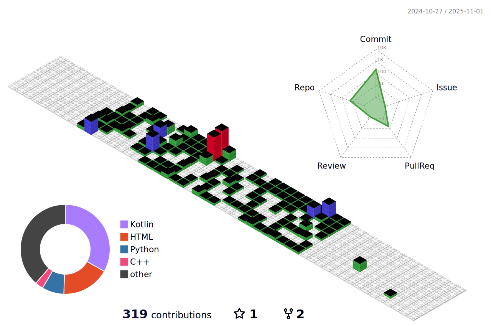

  <h1><b></b>Abhinav Tiwari</b></h1>
  
  
  
Building full-stack applications, scaling distributed systems and automating DevOps workflows.

  
Currently learning Web3 and blockchain

  
<b>Grinding Leetcode</b>

  
I build Projects on the Trending Topics on Reddit & Twitter; My Think Tank

---

 
  
## Connect With Me:

## Tech Stack

### 🖥️ Languages

### ⚡ Frameworks & Tools I use

### 🗄️ Databases I have worked upon

### 🛠 DevOps & Cloud

### 🔗 Authentication & Security

### 📦 Monorepo & CI/CD

### 🔗 Web3 & Blockchain (Currently Learning)

<h1>Contribution in Git Block Form</h1>

https://abhinavtiwari.tiiny.site

